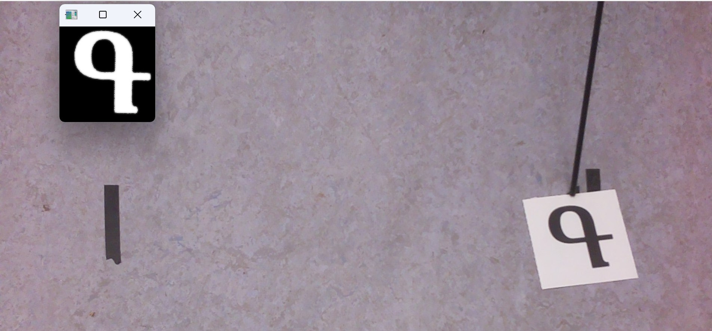

# Отчёт команды "Покорители неба" о ходе разработки неросети для распознавания армянского алфавита
## 1. Введение
Задача, поставленная организаторами, заключается в локализации изображений букв армянского алфавита на видеопотоке и их последующей классификации. Мы решили начать с задачи классификации, обучая нейросеть распознавать буквы армянского алфавита. Для решения этой задачи мы подготовили свой датасет, который впоследствии использовался для обучения и тестирования модели.
## 2. Сбор датасета
Для сбора датасета мы исходили из предположения, что БПЛА летит на высоте примерно 30-50 метров, а размеры полотен с буквами составляют 3х3 метра. Для удобства сборки датасета и сохранения пропорций размеров полотна и количества пикселей на букву относительно камеры был выбран масштаб 1:30: размер полотна с буквой был уменьшен до 10х10 см, а высота от камеры до поверхности съёмки составила около метра.

Камера **Raspberry Pi Camera Module 2**, закреплённая на штативе, производила фотографии букв, ориентированных случайным образом и расположенных на контрастном фоне. Для каждой буквы было сделано по 200 снимков, всего 7200 снимков для всех 36 букв армянского алфавита.

<table>
  <tr>
    <td><image
  src="images/image.png" width="200"
  alt="Текст с описанием картинки"
  caption="Подпись под картинкой"></td>
    <td><image width="200"
  src="images/image-1.png"
  alt="Текст с описанием картинки"
  caption="Подпись под картинкой"></td>
  </tr>
    <tr>
    <td>Процесс сборки датасета</td>
    <td>Полученное изображение</td>
  </tr>
</table>

## 2. Предобработка изображений
Чтобы распознавание работало при разных положениях буквы относительно БПЛА, мы рассмотрели 2 способа обработки изображений: с применением аффиных преобразований и без. В первом случае поворот и искажение буквы устраняется преобразованиями и на вход нейросети подается нормально ориентированная неискаженная буква. Во втором случае мы не исправляем букву, а добавляем в датасет множество новых уникальных положений и поворотов буквы с помощью аугментации. По итогам обучения и тестов пришли к выводу, что второй способ работает стабильнее, имея при этом также хорошую точность. Он и был выбран.

Предобработка изображений выполнялась с помощью  `data_preprocessing.py`. Краткое описание преобразований: 
- Фильтрация для уменьшения шумов и сглаживагия фона;
- Бинаризация и поиск контура полотна с буквой;
- Удаление фона и обрезка;
- Примененме маски для удаления лишних объектов с изображения. В результате остается белый контур буквы на чёрном фоне;
- Фильтрация;
- Сжатие до размеров 32х32;

После обработки датасет был увеличен в 5 раз применением аугментации:
- Случайный поворот буквы в пределах от 0 до 360;
- Случайная обрезка изображения, которая позволяет изменить положение буквы;
- Случайное изменения соотношение сторон в промежутке от 0.7 до 1;

Итого объем датасета был увеличен до более чем 35000 фотографий, разделенный на обучающую, тестовую, и валидационную выборку в соотношении **80%-10%-10%**.
 

Пример исходного и биноризованного изображения

<table>
  <tr>
    <td><image
  src="images/image-3.png" height="200"
  alt="Текст с описанием картинки"
  caption="Подпись под картинкой"></td>
    <td><image height="200"
  src="images/image-7.png"
  alt="Текст с описанием картинки"
  caption="Подпись под картинкой"></td>
  </tr>
    <tr>
    <td>Применение аффинных преобразований</td>
    <td>Без аффинных преобразований</td>
  </tr>
</table>

## 3. Обучение нейросети
Для обучения нейросети была выбрана библиотека `PyTorch`. С использованием её инструментов была спроектирована сверточная нейронная сеть следующей конфигурации:

|Layer (type:depth-idx)| Output Shape   |Param #    |
| ------------      | ------------      | ----------|
| PNebaNet          | [1, 36]           | --        |
| ├─Conv2d: 1-1     | [1, 64, 28, 28]   |  1,664    |
| ├─MaxPool2d: 1-2  | [1, 64, 14, 14]   | --        |
| ├─Conv2d: 1-3     | [1, 128, 12, 12]  | 73,856    |
| ├─MaxPool2d: 1-4  | [1, 128, 6, 6]    |  --       |
| ├─Linear: 1-5     | [1, 128]          | 589,952   |
| ├─Linear: 1-6     | [1, 64]           | 8,256     |
| ├─Linear: 1-7     | [1, 36]           | 2,340     |

Total trainable params: 676,068 

На вход нейросети подавался батч из 8 изображений 32х32 на 10 эпох. Графики обучения получились следующие:

<image
  src="images/image-6.png" width="500"
  alt="Текст с описанием картинки"
  caption="Подпись под картинкой">

# 4. Тестирование обученной нейросети

На обучение было отведено 5 эпох. Результаты для каждой буквы в алфавитном порядке получились следующие:

- Accuracy of     0 : 98.958333 %
- Accuracy of     1 : 100.000000 %
- Accuracy of     2 : 100.000000 %
- Accuracy of     3 : 95.959596 % 
- Accuracy of     4 : 91.818182 %
- Accuracy of     5 : 86.813187 %
- Accuracy of     6 : 98.260870 %
- Accuracy of     7 : 98.148148 %
- Accuracy of     8 : 98.347107 %
- Accuracy of     9 : 95.789474 %
- Accuracy of    10 : 92.156863 %
- Accuracy of    11 : 100.000000 %
- Accuracy of    12 : 100.000000 %
- Accuracy of    13 : 95.535714 %
- Accuracy of    14 : 99.082569 %
- Accuracy of    15 : 98.214286 %
- Accuracy of    16 : 97.701149 %
- Accuracy of    17 : 100.000000 %
- Accuracy of    18 : 100.000000 %
- Accuracy of    19 : 100.000000 %
- Accuracy of    20 : 100.000000 %
- Accuracy of    21 : 97.849462 %
- Accuracy of    22 : 95.744681 %
- Accuracy of    23 : 90.476190 %
- Accuracy of    24 : 99.019608 %
- Accuracy of    25 : 99.082569 %
- Accuracy of    26 : 98.823529 %
- Accuracy of    27 : 98.958333 %
- **Accuracy of    28 : 63.736264 %**
- Accuracy of    29 : 96.551724 %
- Accuracy of    30 : 98.924731 %
- Accuracy of    31 : 97.979798 % 
- Accuracy of    32 : 99.074074 % 
- Accuracy of    33 : 100.000000 %
- Accuracy of    34 : 100.000000 %
- Accuracy of    35 : 100.000000 %

В общем случае точность распознавания составила более 85% процентов, за исключением букв 23 и 28, которые при повороте на 180° превращаются друг в друга.

<table>
  <tr>
    <td><image
  src="images/image-5.png" height="250"
  alt="Текст с описанием картинки"
  caption="Подпись под картинкой"></td>
    <td><image height="250"
  src="images/image-4.png"
  alt="Текст с описанием картинки"
  caption="Подпись под картинкой"></td>
  </tr>
    <tr>
    <td>Буква 23</td>
    <td>Буква 28</td>
  </tr>
</table>
